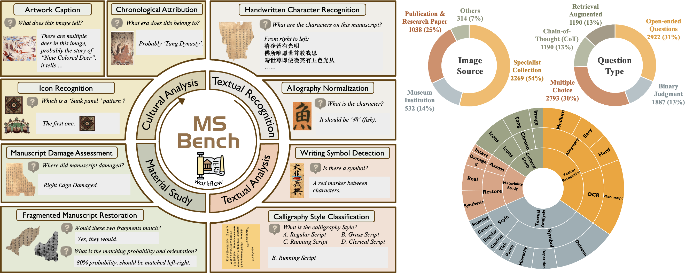
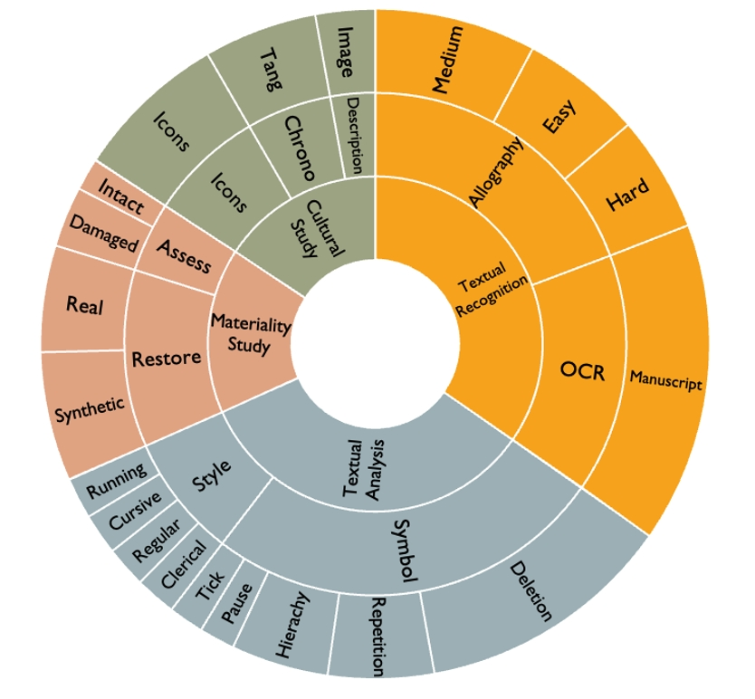
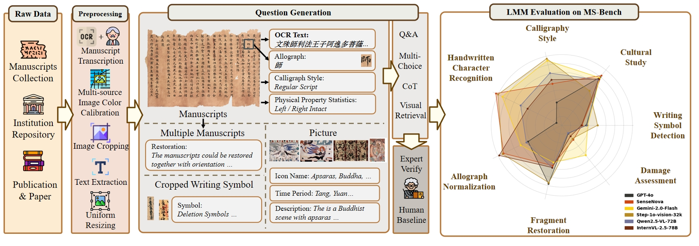
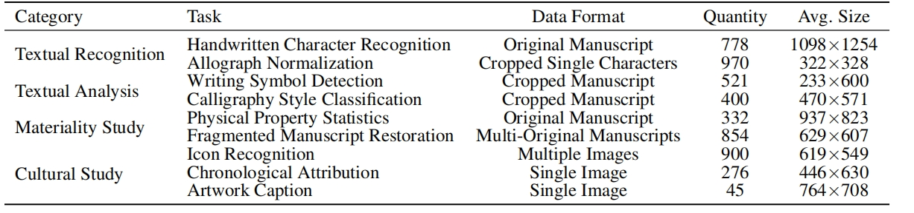
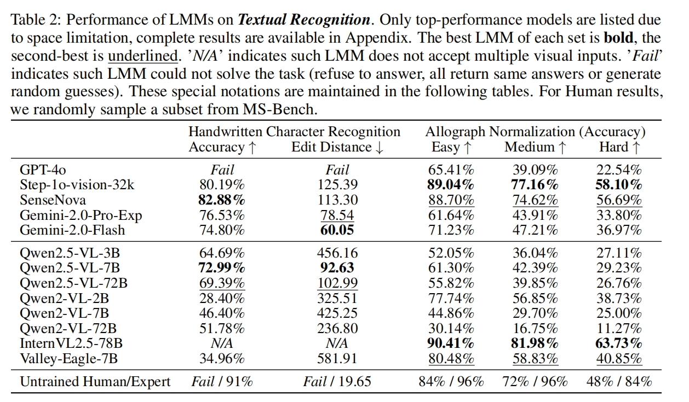
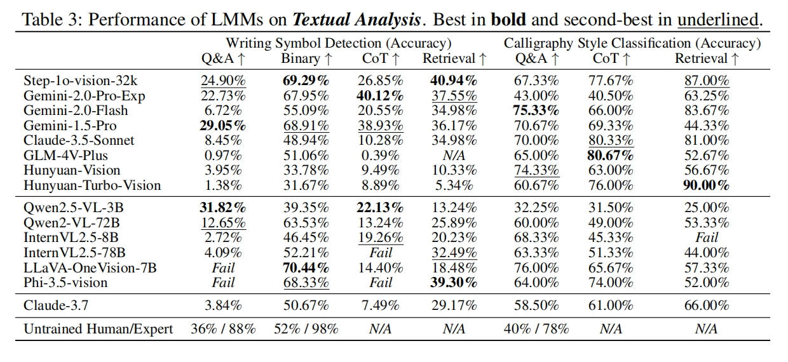
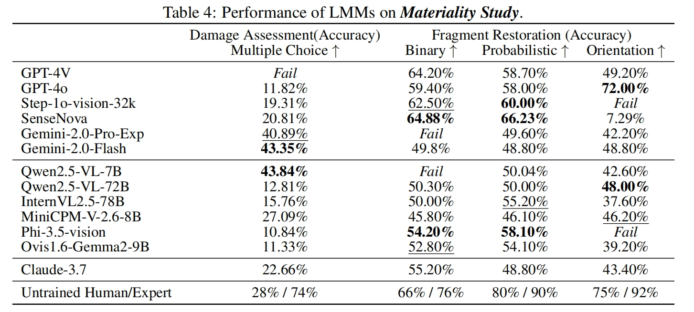
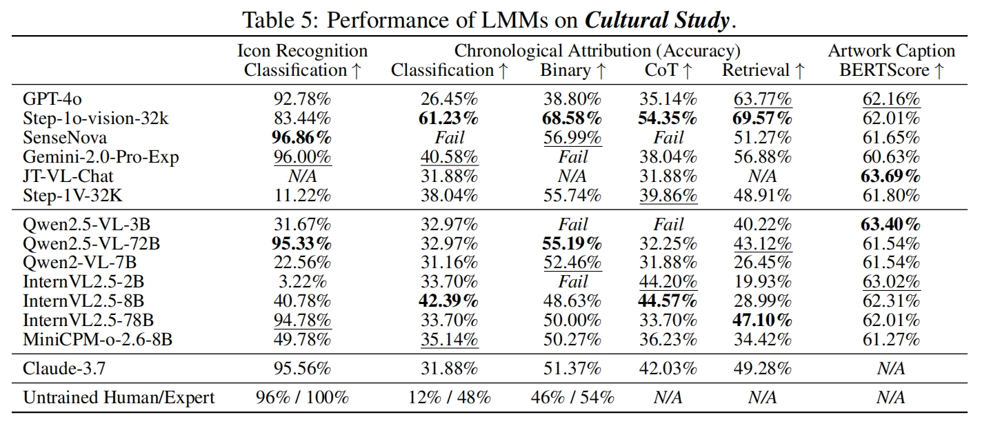

<div align="center">

# MS-Bench: A Multimodal Benchmark for Evaluating Large Language Models in Ancient Manuscript Study [NEURIPS 2025 Datasets and Benchmarks Track🔥]

**Yuqing Zhang** <sup> * </sup> · **Yue Han** <sup>*</sup>  · **Shuanghe Zhu**· **Haoxiang Wu** · **Hangqi Li** ·  **Shengyu Zhang**· **Junchi Yan** · **Zemin Liu** · **Kun Kuang** · **Huaiyong Dou** · **Yongquan Zhang** · **Fei Wu**

[](https://neurips.cc/virtual/2025/poster/121478)
[](https://github.com/ianeong/MS-Bench)
[](./LICENSE)
<small><sup>*</sup> Equal Contribution</small>


<hr style="border: none; height: 3px; background: linear-gradient(to right, #d4af37, #b8860b, #d4af37); margin: 20px 0;">


⭐ If you like our project, please give us a star on GitHub for the latest updates!

<hr style="border: none; height: 3px; background: linear-gradient(to right, #d4af37, #b8860b, #d4af37); margin: 20px 0;">





## 🔍 Overview

Analyzing ancient manuscripts has traditionally been a labor-intensive and time-consuming task for philologists. Recent advancements in LMMs have demonstrated their potential across various domains, yet their effectiveness in manuscript study remains largely unexplored. 

We present **MS-Bench**, the first comprehensive benchmark co-developed with archaeologists, comprising **5,076 high-resolution images** from 4th to 14th century and **9,982 expert-curated questions** across nine sub-tasks aligned with archaeological workflows. 

Through **four prompting strategies**, we systematically evaluate **32 LMMs** on their effectiveness, robustness, and cultural contextualization. 



> Our comprehensive benchmark consist of multi-source, multi-scale manuscripts. Tasks are hierarchically organized to address domain challenges. Multiple question formats assess LMMs’ effectiveness and robustness.

## 📘General Principles



> Illustration of MS-Bench construction pipeline (data source collection, preprocessing, question generation, annotation and human expert verification) and LMM evaluation results. LMMs demonstrate task-specific capability divergence.

We adhere to the following three principles: 

**(1) Scholarly-driven Holistic Task Design Philosophy:** MS-Bench encapsulates archaeologists’ workflows, from labor-intensive, time-consuming and error-prone process in *Textual Recognition &* *Analysis*, to context-intensive reasoning in *Materiality & Cultural Study*. 

**(2) Hierarchical Task Framework:** Co-developed with 7 domain experts, MS-Bench categorizes tasks into *4 vertical tiers* and *9 horizontal sub-tasks*.

**(3) Large-scale Multi-source Data Curation:** Centered on the most extensive and diverse collection of Dunhuang manuscripts, MS-Bench integrates 5,076 high-resolution images and 9982 Q&A pairs. 



> Details of our **MS-Bench**

## 📊 Dataset

The dataset contains **images** and a **json file** with prompt of each task. 

Our dataset has been released on [Google Drive](https://drive.google.com/file/d/1P0nlkG_AKGf9LRd1QJMNBj2gYh4B8SAS/view?usp=drive_link).  
You can access and download it via the link above.

## 🚀 Usage: Running Benchmarks via API

You can evaluate your preferred LLM on MS-Bench using API access (e.g., OpenAI, Anthropic, etc.). Follow the steps below:

#### 1. Prepare API Configuration

Create a new JSON file inside the `api/` directory that stores your model’s API information.

Example:  `api/gpt-4o.json`. 

```json
{
  "api_key": "YOUR_API_KEY",
  "base_url": "MODEL_BASE_URL",
  "model_name": "MODEL_NAME"
}
```

This file will be loaded at runtime to query the model.

#### 2. Set Up Model-Specific Code Directory

Each model should have its own directory under code/. We recommend naming it the same as your model (e.g., gpt-4o).

You can create it by copying an existing model folder (e.g., gpt-4o) as a template:

```bash
mkdir code/my-model-name
cp code/gpt-4o *.py code/my-model-name
```

NOTE: the model name should be the same as the model_name in your json file!

#### 3. Run the Benchmark

Change directory to your model-specific code folder and execute the benchmark

**run a particular task**
```bash
cd code/my-model-name
python YOUR_PARTICULAR_TASK.py  # e.g. python manuscript_ocr.py
```

**run ALL tasks**
```bash
cd code/my-model-name
python run_all_tasks.py
```
This script will:

- Load task prompts and questions from the MS-Bench dataset

- Query your specified model via API

- Save outputs to output/{model_name}/ for further evaluation

#### 4. Output Structure
After execution, results will be saved to output/{model_name}, like:

```
output/
└── my-model-name/
    ├── manuscript_ocr_model_name.json
    ├── image_caption_model_name.json
    └── ...
```
Each file contains model responses for the corresponding sub-task group.

## 🧪Performance Benchmark on Different Tasks

<details>
<summary>Results on textual recognition tasks (click to expand)</summary>




</details>

<details>
<summary>Results on the textual analysis tasks (click to expand)</summary>




</details>

<details>
<summary>Results on the materiality study tasks (click to expand)</summary>




</details>

<details>
<summary>Results on the cultural study tasks (click to expand)</summary>




</details>

## 📮 Contact

For issues, suggestions, or contributions, feel free to open an issue or PR.
